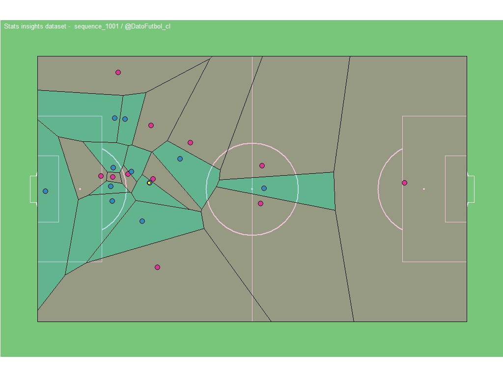

Codes and some explanation about process done for this animation (https://twitter.com/DatoFutbol_cl/status/1131582677558136832).

[Sadly i can't share this used STATS data, but if you are interested about data structure i could give you some details about: ismaelgomezs@gmail.com]

Processing:

1) Reading rawdata (with "pickle" format) using #reticulate package which call a short Python script ("script.py").

2) Preprocessing to get all data in only one dataframe (using #purrr #datatable & #dplyr)

3) Source "soccerAnimate" function to use it. This way you can (a) reshaping one sequence of tracking data as example: players and ball coordinates for each sample using #dplyr #tidyr #stringr & #soccermatics and (b) get the animation (using #ggplot2 #ggsoccer #gganimate & #ggforce). 
You can choose different "method" for adding a 1) convex hull for each team, 2) voronoi areas (default) or 3) clean animation. And also change the color of pitch and teams.

Done!
